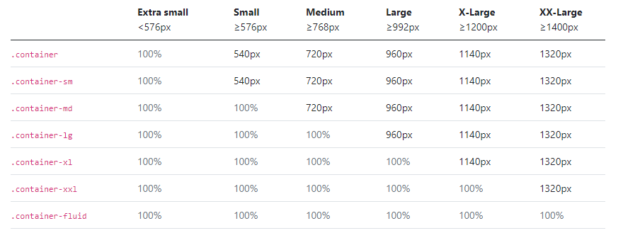

# Recherche sur les graphiques

## Auteur
ludovic.rx@eduge.ch

## Liens utiles

### Charts

[Google Chart](https://developers.google.com/chart "Documentation Google Chart")

[Print to PNG](https://developers.google.com/chart/interactive/docs/printing "Imprimer en png le graphique")

## Bootstrap

[Charts in Tooltip](https://developers.google.com/chart/interactive/docs/customizing_tooltip_content#placing-charts-in-tooltips "Graphiques dans les infobulles")

[DropDown Button](https://getbootstrap.com/docs/4.0/components/dropdowns/ "DropDown Buttons")

[Header](https://www.php.net/manual/fr/function.header "Header PHP")

[Layout Form](https://getbootstrap.com/docs/5.0/forms/layout/, "Layout Form")

###  [Grid](https://getbootstrap.com/docs/5.0/layout/grid/, "Grid")
Les grid ont un nombre maximum de 12
row-cols -> signifie combien il y a de colonne dans la ligne


### [Taille des containers](https://getbootstrap.com/docs/5.0/layout/containers/)



### [Icons Bootstrap](https://icons.getbootstrap.com/)

Il faut rajouter cette ligne pour pouvoir utiliser les classes qui rajoutent les icones. 

```
<link rel="stylesheet" href="https://cdn.jsdelivr.net/npm/bootstrap-icons@1.4.1/font/bootstrap-icons.css">
```

[Footer](https://getbootstrap.com/docs/5.0/examples/sticky-footer/)

